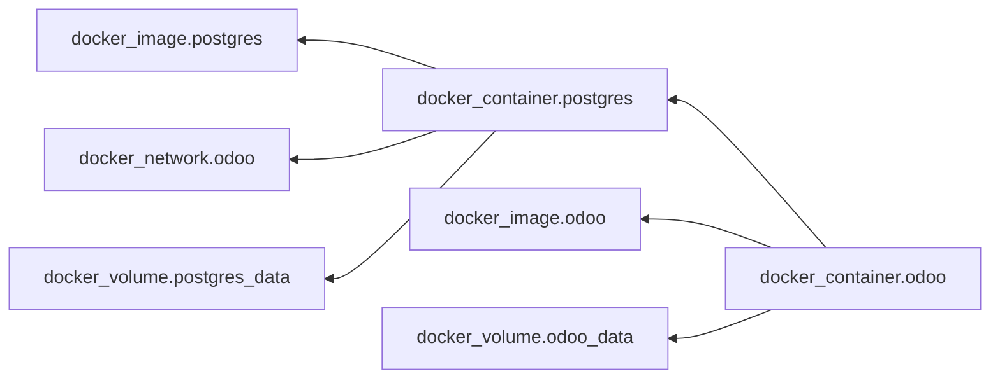

# Infra Foundations: Terraform, Docker, AWS

Ово је foundation документ за кандидата и сваког новог KomITi инжењера који infrastructure слој учи од нуле, али кроз стварни KomITi AWS/Terraform/Docker контекст, не кроз апстрактне toy примјере.

Сврха није да те претвори у cloud/platform специјалисту за 4 сата, него да ти да operational mental model:
- шта у KomITi-ју ради AWS,
- шта ради Docker и терминалска команда `docker compose`,
- шта ради Terraform и његове терминалске команде,
- и како се та три слоја везују у један систем.

## Садржај

- 1\) Шта је infra stack у KomITi-ју
- 2\) AWS основе које мораш знати
- 3\) Docker и container основе које мораш знати
- 4\) Terraform
	- 4.1\) Terraform mental model
	- 4.2\) Шта је provider
	- 4.3\) Шта су resource, data source и output
	- 4.4\) Структура директоријума: општа и KomITi конкретна
	- 4.5\) Terraform фајлови у [modules/]
	- 4.6\) Terraform фајлови у [root stack/]
	- 4.7\) Dependency reasoning
	- 4.8\) Да сумирамо шта Terraform код често значи у овом репоу
	- 4.9\) Како се AWS, Docker и Terraform вежу у један flow
	- 4.10\) Terraform vs Docker Compose: исте информације, друго мјесто записа
- 5\) Како Tefraform фајлове претворити у акцију и материјализовати артифакте (Docker контејнере, aws ресурсе, Odoo)
	- 5.1\) Plan није формалност
	- 5.2\) Apply није deploy script
- 6\) Minimal safe workflow у KomITi-ју
- 7\) KomITi infra checklist
- 8\) Foundations practical drill
- 9\) Local Terraform + Docker Desktop lab за кандидата
- 10\) Шта читаш даље
- 99\) Задатак на komiti_academy пројекту за кандидата

## 1) Шта је infra stack у KomITi-ју

Кад у овом репоу кажемо „infra“, не мислимо на један алат, него на више слојева који раде заједно:
- AWS је cloud substrate: VM, мрежа, IP, security boundary, disk,
- Docker је runtime packaging и local orchestration слој: како се сервис пакује и покреће у контејнеру, и како се више сервиса координише преко терминалске команде `docker compose`,
- Terraform је infrastructure-as-code слој који описује и мијења AWS ресурсе,
- Odoo/Caddy/Postgres су application/runtime workload који на том слоју живи.

Професионално размишљање овдје је:
- Terraform не замјењује Docker,
- Docker не замјењује AWS,
- AWS не замјењује application verification,
- сваки слој има своју сврху, свој risk и свој operational vocabulary.

## 2) AWS основе које мораш знати

AWS у овом learning контексту не учиш као каталог 200 сервиса, него као минимални operational set.

Најбитнији concepts су:
- region: географски/оперативни контекст у ком ресурси живе и у ком мораш досљедно размишљати о latency-ју, доступности и resource locality-ју,
- `EC2`: виртуелна машина на којој runtime стварно живи,
- `VPC` / subnet: мрежни простор и сегментација,
- security group: inbound/outbound firewall boundary,
- `EIP` (`Elastic IP`): стабилна јавна IP адреса,
- `S3`: object storage слој у ком се често држе backup-и и други артефакти који не припадају filesystem-у саме VM,
- `Route 53` / DNS thinking: како домен дође до правог host-а,
- disk/volume reasoning: runtime није само CPU и RAM него и storage.

У KomITi mental model-у то типично значи:
- region одређује у ком AWS контексту тај runtime и зависни ресурси уопште постоје,
- један EC2 host носи runtime слој,
- security group одређује ко може на SSH/HTTP/HTTPS,
- `S3` носи backup/storage слој који не желиш везати само за животни циклус једне VM,
- EIP и DNS везују host за јавни endpoint,
- мрежа и security boundary су дио production safety-а, не споредан детаљ.

Junior грешка је да AWS гледа као „само сервер“. Бољи mental model је:
- region = гдје ти compute и остали ресурси стварно живе,
- EC2 = compute,
- security group = ко смије да прича са тим compute-ом,
- S3 = durable object storage за backup-е и operational артефакте,
- subnet/VPC = гдје тај compute живи,
- IP/DNS = како други системи долазе до њега.

## 3) Docker и container основе које мораш знати

Container није виртуелна машина. То је изолован runtime process са својим filesystem view-ом, network namespace-ом и договореним entrypoint-ом.

Најбитнији concepts су:
- image: template од ког контејнер настаје,
- container: running instance тог image-а,
- volume: persistent data који не желиш изгубити кад се container ре-креира,
- port mapping: како service из контејнера постаје доступан host-у,
- environment variables: runtime конфигурација,
- `docker compose`: декларативни опис више сервиса који раде заједно.

У KomITi контексту је битно рано усвојити:
- Odoo често не ради сам, него са Postgres-ом, reverse proxy-јем и другим helper слојевима,
- `docker compose` је договор како ти сервиси заједно живе,
- restart container-а није исто што и rebuild image-е,
- ephemeral container filesystem (привремени filesystem контејнера) није исто што и persistent data.

Практично размишљање:
- image = шта покрећеш,
- container = шта тренутно ради,
- compose = како више контејнера формира један runtime систем,
- volume = шта мора преживјети restart/recreate cycle.
## 4) Terraform

### 4.1) Terraform mental model

Terraform је infrastructure-as-code алат.

Његова суштина није „направи ми један EC2“, него:
- опиши жељено стање инфраструктуре као код,
- упореди то стање са оним што стварно постоји,
- добиј plan промјена,
- контролисано примјени те промјене.

У KomITi контексту то значи:
- DEV и PROD AWS окружења описујемо Terraform кодом,
- EC2, networking, security groups и EIP нису ручни кликови у AWS console-у,
- `terraform plan` је доказ шта ће се промијенити,
- `terraform apply` је контролисана примјена,
- state фајл `terraform.tfstate` је runtime истина Terraform-а о ресурсима које управља; у odoo4komiti репоу га нпр. видиш у `infra/aws/odoo-dev-ec2-compose/terraform.tfstate`.

### 4.2) Шта је provider

Provider је plugin који Terraform-у омогућава да прича са неким системом.

У овом репоу најбитнији је: AWS provider. Практично:
- Terraform сам по себи не зна шта је EC2, VPC или Elastic IP,
- AWS provider му даје тај vocabulary и API bridge.

Ако гледаш Terraform код, `provider` слој је оно што Terraform повезује са стварним cloud-ом.

### 4.3) Шта су resource, data source и output

`resource` описује нешто што Terraform прави или мијења. Примјери из нашег AWS контекста:
- EC2 instance,
- security group,
- elastic IP,
- route table,
- key pair.

`data` чита нешто што већ постоји, без ownership-а над тим ресурсом. Практично:
- resource = Terraform управља животним циклусом,
- data source = Terraform само чита.

`output` износи битну вриједност напоље. У KomITi контексту то су често:
- public IP,
- SSH команда,
- HTTP/HTTPS URL,
- други runtime identifier-и који ти требају послије `apply`.

### 4.4) Структура директоријума: општа и KomITi конкретна

Кад први пут читаш Terraform репо, није довољно да знаш шта је `resource`; мораш знати и гдје шта живи.

KomITi конкретан layout изгледа отприлике овако:

```text
KOMITI КОНКРЕТНО

[infra/]
	|
	+-- [aws/]
		 |
		 +-- CODEX_TERRAFORM.md                          -> КомИТи policy/disciplina документ made by КомИТи
		 +-- [modules/]                                  -> reusable Terraform module-и
		 |    |
		 |    +-- [odoo_ec2_compose/]                    -> shared module који root stack-ови reuse-ују
		 |         |
		 |         +-- main.tf                           -> module internal resources и wiring
		 |         +-- variables.tf                      -> inputs које module прима од root stack-а
		 |         +-- outputs.tf                        -> module outputs
		 +-- [odoo-dev-ec2-compose/] је [root stack/] за dev
		 |    |
		 |    +-- main.tf / versions.tf                  -> root Terraform setup
		 |    +-- network.tf / security.tf / compute.tf / locals.tf
		 |    +-- variables.tf / outputs.tf              -> root inputs/outputs за dev stack, не за унутрашњост module-а
		 |    +-- templates/ / scripts/                  -> template-и и helper оперативне скрипте
		 |    +-- README.md / RUNBOOK.md                 -> operator documentation
		 |    +-- terraform.tfvars / terraform.tfstate   -> локални runtime/state фајлови, нису за commit
		 |    +-- .terraform/ / .terraform.lock.hcl      -> локални provider/cache и lock после init
		 |
		 +-- [odoo-prod-ec2-compose/] је [root stack/] за prod
				|
				+-- main.tf / versions.tf
				+-- network.tf / security.tf / compute.tf / locals.tf
				+-- variables.tf / outputs.tf
				+-- templates/ / scripts/
				+-- README.md / RUNBOOK.md
				+-- terraform.tfvars / terraform.tfstate
				+-- .terraform/ / .terraform.lock.hcl
```

Кратко правило за читање овог layout-а: `modules/odoo_ec2_compose/main.tf` и `modules/odoo_ec2_compose/variables.tf` припадају reusable module-у, док `odoo-dev-ec2-compose/main.tf` и `odoo-dev-ec2-compose/variables.tf` припадају root stack-у који тај module позива. Значи, нису дупликати у истој улози: module има свој унутрашњи Terraform API, а root stack има свој environment-level API.

Практично, кад кажемо „Terraform код за DEV“, у овом репоу то најчешће значи: отвори `infra/aws/odoo-dev-ec2-compose/` и читај тај директоријум као један инфраструктурни систем.

Имај на уму да назив `odoo-dev-ec2-compose` већ носи 3 слоја у себи:
- `ec2` = AWS compute host,
- `compose` = Docker runtime orchestration на том host-у,
- Terraform `.tf` фајлови = опис инфраструктуре која тај host и његов boundary прави.

### 4.5) Terraform фајлови у [modules/]

Након што видиш да у `modules/` постоји `odoo_ec2_compose/`, важно је да не мислиш да је то само помоћни фолдер. То је reusable Terraform building block који root stack-ови позивају.

У том module-у су најважнија 3 фајла:

#### 4.5.1) `main.tf`

`main.tf` у module-у описује унутрашњу логику reusable блока: које AWS resource-е module прави и како су повезани. У нашем KomITi примјеру ту видиш да module гради више слојева одједном, нпр. `VPC`, subnet, route table, security group и остале resource-е које root stack не жели сваки пут писати испочетка.

У самом `modules/odoo_ec2_compose/main.tf` су додати кратки teaching comments уз `resource "aws_vpc" "main"` и `resource "aws_subnet" "public_a"`. Коментари показују двије важне ствари: да module прво поставља network foundation и да subnet већ открива dependency на VPC и public/private намјену.

Практично: ако желиш да разумјеш шта `odoo_ec2_compose` заиста ради кад га dev/prod stack позове, module `main.tf` је прво мјесто за читање.

#### 4.5.2) `variables.tf`

`variables.tf` у module-у дефинише улазни API тог reusable блока. Ту module каже: ако хоћеш да ме користиш, мораш ми дати или можеш ми дати вриједности као што су `name_prefix`, `env`, `allowed_ssh_cidr`, `instance_type`, `ssh_public_key` и слично. Другим ријечима: root stack преко свог `main.tf` позива module, а module `variables.tf` одређује шта тај позив смије и мора да прослиједи.

#### 4.5.3) `outputs.tf`

`outputs.tf` у module-у дефинише шта module враћа назад root stack-у. У нашем случају то су битне operational вриједности као што су public IP, elastic IP или backup bucket name. То је важно јер root stack често не жели само да "упали" module, него и да преузме неке његове резултате и покаже их оператору или прослиједи даље.

### 4.6) Terraform фајлови у [root stack/]

Након што разумијеш структуру директоријума, има смисла да читаш и шта раде кључни Terraform фајлови унутар тог stack-а.

#### 4.6.1) Terraform State `terraform.tfstate`

`terraform.tfstate` је кључни артефакт који садржи стање свих ресурса.

State памти:
- које ресурсе Terraform сматра својима,
- њихове ID-еве,
- атрибуте који су потребни за наредни plan,
- dependency graph који је већ materialized у runtime-у.

Зато су важна правила:
- state се не комитује у git,
- state може садржати осјетљиве податке,
- губитак state-а није „мањи проблем“, него operational problem,
- ручне промјене у AWS console-у могу створити drift између state-а и стварности.

У KomITi начину рада мораш рано усвојити:
- source code није довољан,
- Terraform state + cloud runtime = стварна истина.

Не радити ручне промјене директно у AWS console-у јер оне ручне измјене које Терраформ код и state не испрате брзо праве drift између Terraform слике и стварног runtime-а.

- код може говорити једно, state памтити друго, а cloud runtime изгледати треће;
- ако ручно мијењаш ресурс у incident ситуацији, документуј шта је урађено;
- ownership што прије врати у код и state дисциплину;
- `terraform plan` читај и као drift detector, не само као apply prelude.

#### 4.6.2) `variables.tf`, `terraform.tfvars.example` и `terraform.tfvars`

Variables су улазни параметри Terraform конфигурације.

Оне постоје да код не hardcode-ује:
- CIDR правила,
- instance type,
- домен,
- кључне naming/runtime вриједности,
- понекад и credentials/secrets, ако модел то дозвољава.

Овдје су битна 3 различита фајла:

Фајл `variables.tf`	описује који улазни параметри уопште постоје, ког су типа и шта је опционо или има default вриједност. Не мора свака variable имати default; поента овог фајла је да дефинише schema-у коју stack очекује. Ту нпр. видиш да Terraform очекује `instance_type`, `domain_name` или `allowed_ssh_cidr`.

Фајл `terraform.tfvars` (`terraform.tfvars.example` није ништа друго не примјер како треба `terraform.tfvars` изгледати) то су стварне, локалне вриједности које Terraform користи при `plan`/`apply`. Ту заиста стоји шта је за тај clone и тај environment `instance_type`, који је домен, који је SSH CIDR и слично. У PROD контексту то је предвиђено локално мјесто `infra/aws/odoo-prod-ec2-compose/terraform.tfvars`, ако га оператор заиста креира за тај environment. Важно: DEV и PROD stack овдје намјерно не користе исти secret model. Зато се за PROD стварни `infra/aws/odoo-prod-ec2-compose/terraform.tfvars` у репоу не version-ује, а чак и кад га оператор локално направи, он не смије садржати PROD тајне. По том моделу, тајни подаци се чувају на самом PROD EC2 серверу, а не у Terraform git артефактима; то је дефинисано у `infra/aws/CODEX_TERRAFORM.md`, поглавље `5.2 Terraform apply`.

Terraform почетник често види variable и помисли да је нормално убацити сваку лозинку у `tfvars`.

То није увијек прихватљиво.

Мораш мислити:
- да ли та вриједност завршава у state-у,
- да ли се state чува локално или remote,
- ко има приступ том state-у,
- да ли secret припада Terraform слоју или bootstrap/runtime слоју.

У KomITi контексту посебно је важно:
- DEV има нешто више tolerance за lab/runtime convenience,
- PROD има строжију secret discipline,
- није свака operational тајна добра Terraform тајна.

Кључна дисциплина:
- `terraform.tfvars` може бити осјетљив,
- не иде у git,
- за PROD посебно не гураш DB/Odoo лозинке у Terraform ако ће завршити у state-у,
- фајлови `terraform.tfstate` и `terraform.tfstate.backup` су локални state артефакти; у овом репоу их нпр. видиш у `infra/aws/odoo-dev-ec2-compose/terraform.tfstate` и `infra/aws/odoo-dev-ec2-compose/terraform.tfstate.backup`, и управо зато не треба да постану нормалан дио version control-а.

#### 4.6.3) `main.tf`

`main.tf` је најчешће улазна тачка stack-а: ту обично прво видиш који module-и се користе, како се root stack повезује са њима и које кључне variables им се просљеђују. Ако отвараш само један Terraform фајл да стекнеш брзу слику architecture-а, `main.tf` је обично најбоље прво мјесто.

Разлика у односу на `main.tf` из `#### 4.5.1)` је у нивоу одговорности:
- module `main.tf` описује шта reusable блок прави унутра,
- root stack `main.tf` описује како конкретан dev/prod environment позива тај module и са којим вриједностима.

Другим ријечима: у `modules/odoo_ec2_compose/main.tf` гледаш internal implementation reusable блока, а у `odoo-dev-ec2-compose/main.tf` или `odoo-prod-ec2-compose/main.tf` гледаш orchestration layer који тај блок укључује у стварни environment.

У KomITi контексту то значи: `main.tf` ти често не даје све детаље о сваком AWS ресурсу, али ти први показује shape stack-а и како су compute, network, security и bootstrap слој повезани.

#### 4.6.4) `network.tf`

`network.tf` је фајл у ком најчешће живи мрежна topology логика: `VPC`, subnet-и, route table-ови, internet gateway и слично. Ако желиш да разумијеш гдје EC2 стварно живи и како уопште излази на интернет, ово је један од првих фајлова које треба да читаш.

#### 4.6.5) `outputs.tf`

`outputs.tf` је фајл који каже које битне вриједности Terraform износи оператору послије `apply`. То су често public IP, SSH команда, URL или неки други идентификатор који ти одмах треба за наредни operational корак.

Зато је `outputs.tf` важан: он је bridge између infra кода и operator рада. Без њега Terraform може успјешно направити ресурсе, а да човјек који ради deploy и даље не види брзо шта му је најбитнији наредни улаз у систем.

### 4.7) Dependency reasoning

Један од најбитнијих Terraform concepts је dependency graph.

Terraform мора знати:
- шта зависи од чега,
- којим редом ресурси настају,
- шта се смије уништити тек након чега,
- гдје reference значи implicit dependency.

Практично:
- EC2 може зависити од subnet-а и security group-а,
- route table association зависи од мреже,
- output често зависи од ресурса који је тек креиран.

На локалном `komiti_academy` Docker Desktop lab-у тај dependency graph изгледа отприлике овако:

Ако кандидат има инсталиран Graphviz `dot`, граф може да генерише из терминала овако:

```bash
terraform graph | dot -Tpng > graph.png
```

Испод је и Mermaid варијанта истог односа зависности, корисна кад желиш да graph читаш директно у markdown документу:



Кад у овом примеру видиш стрелицу:
-  `docker_container.odoo --> docker_container.postgres`, то значи да `docker_container.odoo` зависи од `docker_container.postgres`; 
- `docker_network.odoo` је foundation чвор унутар овог graph-а, а `docker_container.postgres` је у дијаграму приказан као чвор који се на ту мрежу везује;
- из остатка зависности се онда види да `docker_container.odoo` није самосталан, него зависи од других runtime елемената (`docker_container.postgres`, `docker_image.odoo`, `docker_volume.odoo_data`).

Junior грешка је да гледа фајл по фајл, а не graph по graph.

### 4.8) Да сумирамо шта Terraform код често значи у овом репоу

Кад читаш AWS Terraform директоријуме, размишљај овако:

- `network.tf` = networking topology
- `security.tf` = security boundary
- `compute.tf` = instance/runtime host
- `locals.tf` = naming/tagging/helper composition
- `variables.tf` = what is configurable
- `outputs.tf` = what the operator needs after apply
- `templates/*.tpl` = rendered bootstrap/user-data content

То је инфраструктурни еквивалент Odoo mental model-а:
- model -> resource
- field -> argument/attribute
- action/menu wiring -> dependency/reference wiring
- runtime upgrade -> plan/apply cycle

### 4.9) Како се AWS, Docker и Terraform вежу у један flow

Најкориснији foundations mental model за овај репо је овај редослијед:

1. Terraform дефинише AWS ресурсе.
2. AWS даје host, мрежу, security boundary и јавни endpoint.
3. На том host-у Docker/Compose покреће application сервисе.
4. Онда тек мјериш да ли је Odoo runtime стварно здрав.

Зато је важно да не мијешаш класе проблема:
- ако security group не пушта саобраћај, то није Docker bug,
- ако container не диже service, то није нужно Terraform bug,
- ако је Odoo up али functional flow не ради, то више није чист infra problem.

Ово је суштина infrastructure reasoning-а: исти incident може изгледати као „систем не ради“, али root cause може бити у сасвим другом слоју.

### 4.10) Terraform vs Docker Compose: исте информације, друго мјесто записа

Испод је мапирање локалног `komiti_academy` lab-а тако да јасно видиш гдје је иста runtime информација записана у Terraform варијанти, а гдје у Compose варијанти.

<table>
	<colgroup>
		<col width="18%">
		<col width="47%">
		<col width="35%">
	</colgroup>
	<thead>
		<tr>
			<th>Информација</th>
			<th>Terraform</th>
			<th>Compose</th>
		</tr>
	</thead>
	<tbody>
		<tr>
			<td>Назив локалног academy runtime-а</td>
			<td><a href="infra/local/odoo-dev-docker-desktop/locals.tf">locals.tf</a> - <code>name_prefix</code></td>
			<td><a href="infra/local/odoo-dev-docker-desktop/docker-compose.yml">docker-compose.yml</a> - <code>name: komiti-academy-dev</code></td>
		</tr>
		<tr>
			<td>Odoo image</td>
			<td><div><strong>default:</strong> <a href="infra/local/odoo-dev-docker-desktop/variables.tf">variables.tf</a> - <code>odoo_image</code> = <code>odoo:19.0</code></div><div><strong>стварна вриједност:</strong> <a href="infra/local/odoo-dev-docker-desktop/terraform.tfvars">terraform.tfvars</a> - <code>odoo:19.0</code></div><div><strong>гдје се примјењује:</strong> <a href="infra/local/odoo-dev-docker-desktop/compute.tf">compute.tf</a> - <code>docker_image.odoo</code></div></td>
			<td><a href="infra/local/odoo-dev-docker-desktop/docker-compose.yml">docker-compose.yml</a> - <code>services.odoo.image</code></td>
		</tr>
		<tr>
			<td>Postgres image</td>
			<td><div><strong>default:</strong> <a href="infra/local/odoo-dev-docker-desktop/variables.tf">variables.tf</a> - <code>postgres_image</code> = <code>postgres:16</code></div><div><strong>стварна вриједност:</strong> <a href="infra/local/odoo-dev-docker-desktop/terraform.tfvars">terraform.tfvars</a> - <code>postgres:16</code></div><div><strong>гдје се примјењује:</strong> <a href="infra/local/odoo-dev-docker-desktop/compute.tf">compute.tf</a> - <code>docker_image.postgres</code></div></td>
			<td><a href="infra/local/odoo-dev-docker-desktop/docker-compose.yml">docker-compose.yml</a> - <code>services.postgres.image</code></td>
		</tr>
		<tr>
			<td>Host port за Odoo</td>
			<td><div><strong>default:</strong> <a href="infra/local/odoo-dev-docker-desktop/variables.tf">variables.tf</a> - <code>odoo_port</code> = <code>8067</code></div><div><strong>стварна вриједност:</strong> <a href="infra/local/odoo-dev-docker-desktop/terraform.tfvars">terraform.tfvars</a> - <code>odoo_port = 8067</code></div><div><strong>гдје се примјењује:</strong> <a href="infra/local/odoo-dev-docker-desktop/compute.tf">compute.tf</a> - <code>ports.external</code> = <code>var.odoo_port</code></div></td>
			<td><a href="infra/local/odoo-dev-docker-desktop/docker-compose.yml">docker-compose.yml</a> - <code>services.odoo.ports</code></td>
		</tr>
		<tr>
			<td>Мапирање <code>8067 -&gt; 8069</code></td>
			<td><a href="infra/local/odoo-dev-docker-desktop/compute.tf">compute.tf</a> - <code>ports { external = var.odoo_port, internal = 8069 }</code></td>
			<td><a href="infra/local/odoo-dev-docker-desktop/docker-compose.yml">docker-compose.yml</a> - <code>"${ODOO_PORT:-8067}:8069"</code></td>
		</tr>
		<tr>
			<td>Postgres DB name</td>
			<td><div><strong>default:</strong> <a href="infra/local/odoo-dev-docker-desktop/variables.tf">variables.tf</a> - <code>postgres_db</code> = <code>komiti_academy_odoo</code></div><div><strong>стварна вриједност:</strong> <a href="infra/local/odoo-dev-docker-desktop/terraform.tfvars">terraform.tfvars</a> - <code>komiti_academy_odoo</code></div><div><strong>гдје се примјењује:</strong> <a href="infra/local/odoo-dev-docker-desktop/compute.tf">compute.tf</a> - <code>POSTGRES_DB</code> = <code>${var.postgres_db}</code></div></td>
			<td><a href="infra/local/odoo-dev-docker-desktop/docker-compose.yml">docker-compose.yml</a> - <code>POSTGRES_DB</code></td>
		</tr>
		<tr>
			<td>Postgres user</td>
			<td><div><strong>default:</strong> <a href="infra/local/odoo-dev-docker-desktop/variables.tf">variables.tf</a> - <code>postgres_user</code> = <code>odoo</code></div><div><strong>стварна вриједност:</strong> <a href="infra/local/odoo-dev-docker-desktop/terraform.tfvars">terraform.tfvars</a> - <code>admin.komiti_odoo</code></div><div><strong>гдје се примјењује:</strong> <a href="infra/local/odoo-dev-docker-desktop/compute.tf">compute.tf</a> - <code>POSTGRES_USER</code> и Odoo <code>USER</code></div></td>
			<td><a href="infra/local/odoo-dev-docker-desktop/docker-compose.yml">docker-compose.yml</a> - <code>POSTGRES_USER</code> и Odoo <code>USER</code></td>
		</tr>
		<tr>
			<td>Postgres password</td>
			<td><div><strong>default:</strong> <a href="infra/local/odoo-dev-docker-desktop/variables.tf">variables.tf</a> - <code>postgres_password</code> = нема default вриједности</div><div><strong>стварна вриједност:</strong> <a href="infra/local/odoo-dev-docker-desktop/terraform.tfvars">terraform.tfvars</a> - <code>komiti-academy-local-dev</code></div><div><strong>гдје се примјењује:</strong> <a href="infra/local/odoo-dev-docker-desktop/compute.tf">compute.tf</a> - <code>POSTGRES_PASSWORD</code> и Odoo <code>PASSWORD</code></div></td>
			<td><a href="infra/local/odoo-dev-docker-desktop/docker-compose.yml">docker-compose.yml</a> - <code>POSTGRES_PASSWORD</code> и Odoo <code>PASSWORD</code></td>
		</tr>
		<tr>
			<td>Odoo качи Postgres на host <code>db</code></td>
			<td><a href="infra/local/odoo-dev-docker-desktop/compute.tf">compute.tf</a> - Odoo env <code>HOST=db</code> и Postgres network alias <code>db</code></td>
			<td><a href="infra/local/odoo-dev-docker-desktop/docker-compose.yml">docker-compose.yml</a> - Odoo <code>HOST: db</code> и network alias <code>db</code></td>
		</tr>
		<tr>
			<td>Addons bind mount</td>
			<td><a href="infra/local/odoo-dev-docker-desktop/locals.tf">locals.tf</a> - <code>addons_host_path</code><br><a href="infra/local/odoo-dev-docker-desktop/compute.tf">compute.tf</a> - користи се у volume mount-у ка <code>/mnt/extra-addons</code></td>
			<td><a href="infra/local/odoo-dev-docker-desktop/docker-compose.yml">docker-compose.yml</a> - <code>../../../custom-addons:/mnt/extra-addons:rw</code></td>
		</tr>
		<tr>
			<td>Odoo data volume</td>
			<td><a href="infra/local/odoo-dev-docker-desktop/compute.tf">compute.tf</a> - <code>docker_volume.odoo_data</code></td>
			<td><a href="infra/local/odoo-dev-docker-desktop/docker-compose.yml">docker-compose.yml</a> - <code>odoo-data:/var/lib/odoo</code></td>
		</tr>
		<tr>
			<td>Postgres data volume</td>
			<td><a href="infra/local/odoo-dev-docker-desktop/compute.tf">compute.tf</a> - <code>docker_volume.postgres_data</code></td>
			<td><a href="infra/local/odoo-dev-docker-desktop/docker-compose.yml">docker-compose.yml</a> - <code>postgres-data:/var/lib/postgresql/data</code></td>
		</tr>
		<tr>
			<td>Network</td>
			<td><a href="infra/local/odoo-dev-docker-desktop/network.tf">network.tf</a> - <code>docker_network.odoo</code></td>
			<td><a href="infra/local/odoo-dev-docker-desktop/docker-compose.yml">docker-compose.yml</a> - <code>networks.academy</code></td>
		</tr>
		<tr>
			<td>Зависност Odoo од Postgres-а</td>
			<td><a href="infra/local/odoo-dev-docker-desktop/compute.tf">compute.tf</a> - <code>depends_on = [docker_container.postgres]</code></td>
			<td><a href="infra/local/odoo-dev-docker-desktop/docker-compose.yml">docker-compose.yml</a> - <code>depends_on.postgres.condition: service_healthy</code></td>
		</tr>
		<tr>
			<td>URL output</td>
			<td><a href="infra/local/odoo-dev-docker-desktop/outputs.tf">outputs.tf</a> - <code>odoo_url</code></td>
			<td>Нема output блока; практични еквивалент су <code>ports</code> и команда <code>docker compose ps</code></td>
		</tr>
	</tbody>
</table>

Посебно важне напомене:

<table>
	<colgroup>
		<col width="20%">
		<col width="18%">
		<col width="18%">
		<col width="44%">
	</colgroup>
	<thead>
		<tr>
			<th>Тема</th>
			<th>Terraform</th>
			<th>Compose</th>
			<th>Шта то значи</th>
		</tr>
	</thead>
	<tbody>
		<tr>
			<td>Master Password за localhost Odoo</td>
			<td>Није експлицитно дефинисан</td>
			<td>Није експлицитно дефинисан</td>
			<td>Ниједан од ваших academy фајлова тренутно не задаје <code>admin_passwd</code>, па password који видиш у browser-у не долази директно из овог Terraform/Compose wiring-а.</td>
		</tr>
		<tr>
			<td>Postgres healthcheck</td>
			<td>Нема</td>
			<td>Има</td>
			<td>Compose варијанта је ту мало богатија, јер има експлицитан <code>healthcheck</code> и чека да Postgres буде здрав прије Odoo старта.</td>
		</tr>
		<tr>
			<td>Docker Desktop UI grouping</td>
			<td>Нема Compose metadata</td>
			<td>Има Compose metadata</td>
			<td>Зато је Compose груписан у Docker Desktop UI-ју, а Terraform Docker provider ресурси изгледају више као појединачни Docker објекти.</td>
		</tr>
		<tr>
			<td>State</td>
			<td><code>terraform.tfstate</code></td>
			<td>Нема један state фајл</td>
			<td>Terraform памти жељено и стварно стање у свом state-у, док се Compose више ослања на тренутно Docker engine стање и Compose пројектне metadata ознаке.</td>
		</tr>
	</tbody>
</table>

## 5) Како Tefraform фајлове претворити у акцију и материјализовати артифакте (Docker контејнере, aws ресурсе, Odoo)

### 5.1) Plan није формалност

`terraform plan` је терминалска команда, и није checkbox прије `apply`.

Његова сврха је да ти јасно покаже:
- шта ће бити креирано,
- шта ће бити измијењено,
- шта ће бити обрисано,
- да ли нека наизглед мала промјена има велик blast radius.

Професионално размишљање значи:
- прво читаш plan,
- онда процјењујеш impact,
- тек онда радиш `apply`.

Ако не умијеш прочитати Terraform plan, онда још ниси operationally safe за инфраструктурни рад.

### 5.2) Apply није deploy script

`terraform apply` терминалска команда не значи „пустио сам сервер и готово“.

Apply значи:
- Terraform је примијенио infrastructure промјену,
- state је ажуриран,
- cloud ресурсни слој је доведен ближе описаном стању.

Али то није исто што и:
- да је апликација functional,
- да је compose stack здрав,
- да је Odoo operational,
- да су day-2 ops кораци завршени.

У KomITi AWS контексту често иде овако:
1. Terraform подигне инфраструктурни skeleton.
2. Bootstrap/compose/runtime слој доведе апликацију у operational state.
3. Онда слиједи verification.

То је иста ментална дисциплина као код Odoo-а: infra code truth није исто што и runtime truth.

## 6) Minimal safe workflow у KomITi-ју

Кад радиш Terraform промјену, minimum safe редослијед је:

1. разуми шта ресурсно мијењаш,
2. провјери variables и environment context,
3. покрени `terraform init` ако треба,
4. покрени `terraform validate`,
5. покрени `terraform plan`,
6. прочитај impact,
7. тек онда покрени `terraform apply`,
8. провјери outputs и runtime,
9. документуј operational delta ако је битан.

То није бирократија; то је основна production discipline.

## 7) KomITi infra checklist

Кад завршиш овај документ, мораш моћи објаснити:
- шта AWS даје, а шта не даје,
- шта је image, а шта container,
- шта ради `docker compose`,
- шта је provider,
- шта је resource, а шта data source,
- зашто је state критичан,
- зашто `plan` читаш прије `apply`,
- зашто `terraform.tfvars` и state не иду у git,
- зашто infrastructure apply није исто што и application verification,
- како да читаш AWS Terraform фолдер као систем, а не као скуп случајних `.tf` фајлова,
- како да разликујеш AWS problem, Docker/runtime problem и Odoo functional problem.

## 8) Foundations practical drill

После овог документа уради бар ово:

1. Отвори `infra/aws/odoo-dev-ec2-compose`.
2. Пронађи `variables.tf`, `compute.tf`, `security.tf`, `outputs.tf`.
3. Објасни који `.tf` фајл дефинише host, који network boundary, а који operator outputs.
4. Објасни гдје у том stack-у престаје Terraform, а почиње Docker/runtime reasoning.
5. Објасни зашто `terraform plan` мора доћи прије `apply`.
6. Објасни зашто за PROD не желимо да DB/Odoo лозинке живе у Terraform state-у.
7. Објасни разлику између `infra/aws/CODEX_TERRAFORM.md` и root stack директоријума као што је `infra/aws/odoo-dev-ec2-compose/`.

Ако ово не можеш објаснити без нагађања, још ниси стварно усвојио infra foundations.

Овај infra drill није директно task имплементације модула, али је припрема да касније за `komiti_academy` разликујеш code problem, runtime problem и infra problem.

## 9) Local Terraform + Docker Desktop lab за кандидата

Ако кандидат нема AWS/Azure lab буџет, има смисла да први Terraform lab ради локално преко Docker Desktop-а.
Овај lab није дио core product scope-а модула `komiti_academy`, него learning/support exercise да кандидат локално подигне runtime на ком ће касније развијати и провјеравати Odoo модул.

Сврха овог lab-а није да глуми прави cloud deployment, него да кандидат практично увјежба:
- структуру Terraform пројекта,
- `variables.tf`, `outputs.tf`, `terraform.tfvars.example` и локални `terraform.tfvars`,
- separation између `dev` и `prod` варијанте stack-а,
- naming conventions,
- `plan` / `apply` / `destroy` циклус,
- идеју да Terraform доводи runtime skeleton у стање у ком Odoo може да се покрене.

Овај lab не учи стварни cloud networking, VM lifecycle и cloud security boundary. То мораш знати да не замијениш локални Docker lab са стварним AWS/Azure infra радом.
Треба да овај lab гледаш као bridge: pattern-и око variables, outputs, naming-а и environment separation касније се могу пренијети на AWS/Azure Terraform рад, али ово није 1:1 cloud template.

Предложени lab нека живи у твом репоу `komiti_academy_ime_polaznika`, нпр. овако:
- `infra/local/odoo-dev-docker-desktop/`
- `infra/local/odoo-prod-docker-desktop/`

Унутар сваког од та два root директоријума candidate треба да има бар:
- `versions.tf`
- `main.tf`
- `variables.tf`
- `outputs.tf`
- `terraform.tfvars.example`
- локални `terraform.tfvars` који не иде у git

Минимални runtime који Terraform локално треба да подигне је:
- једна Docker network,
- један Postgres container,
- један Odoo container,
- volume за Postgres data,
- volume или mount reasoning за Odoo config/addons ако lab дође до те фазе,
- operator output који каже на ком URL-у Odoo треба да буде доступан.

Добар minimum viable lab је:
1. Terraform Docker provider локално управља Docker Desktop runtime-ом.
2. `main.tf` прави network, volume и оба container-а.
3. `variables.tf` носи назив окружења, порт, DB credentials за lab и naming prefix.
4. `outputs.tf` избацује URL типа `http://localhost:8069` и кључне називе ресурса.
5. `terraform.tfvars.example` постоји и за `dev` и за `prod`, тако да candidate види separation чак и кад оба stack-а живе локално.

Bootstrap idea у овом локалном lab-у не значи cloud-init на VM-у, него:
- Terraform прво доведе Docker ресурсе у жељено стање,
- онда Odoo container добије environment/config да може причати са Postgres-ом,
- па тек онда провјераваш да ли је runtime стварно up.

Minimum safe lab flow нека буде:
1. `terraform init`
2. `terraform validate`
3. `terraform plan -var-file=terraform.tfvars`
4. `terraform apply -var-file=terraform.tfvars`
5. `docker ps` и провјера да су Odoo и Postgres up
6. отварање Odoo URL-а из `output` вриједности
7. `terraform destroy -var-file=terraform.tfvars`

Ако candidate успјешно уради овај lab, онда је стварно увјежбао Terraform shape и lifecycle дисциплину, чак иако још није радио прави cloud provisioning.

## 10) Шта читаш даље

- `../infra/aws/CODEX_TERRAFORM.md`
- `../infra/aws/odoo-dev-ec2-compose/README.md`
- `../infra/aws/odoo-dev-ec2-compose/RUNBOOK.md`
- `../infra/aws/odoo-prod-ec2-compose/README.md`
- `../infra/aws/odoo-prod-ec2-compose/RUNBOOK.md`

## 99) Задатак на komiti_academy пројекту за кандидата

1. Напиши кратку infra/runtime дијагностичку биљешку за `komiti_academy`: шта би прво провјеравао ако модул не ради, а шта ако runtime уопште није здрав.  
Референца: Ово је објашњено у поглављима `### 4.9) Како се AWS, Docker и Terraform вежу у један flow` и `## 8) Foundations practical drill`.
2. За `komiti_academy` попиши које runtime претпоставке морају бити истините прије стварне провјере да модул ради.  
Референца: Ово је објашњено у поглављима `## 3) Docker и container основе које мораш знати`, `#### 4.6.1) terraform.tfstate` и `## 6) Minimal safe workflow у KomITi-ју`.
3. Објасни на једном примјеру зашто container restart, module upgrade и стварна провјера захваћеног flow-а нису иста ствар.  
Референца: Ово је објашњено у поглављима `## 3) Docker и container основе које мораш знати`, `### 4.9) Како се AWS, Docker и Terraform вежу у један flow` и `## 6) Minimal safe workflow у KomITi-ју`.
4. Осмисли и локално опиши Terraform lab у свом репоу `komiti_academy_ime_polaznika` који преко Docker Desktop-а подиже Postgres и Odoo stack за локални `dev` runtime, са јасном структуром фајлова, variables, outputs и јасним редослиједом рада.  
Референца: Ово је објашњено у поглављима `#### 4.6.2) \`variables.tf\`, \`terraform.tfvars.example\` и \`terraform.tfvars\``, `### 4.4) Структура директоријума: општа и KomITi конкретна`, `### 5.1) Plan није формалност`, `## 6) Minimal safe workflow у KomITi-ју` и `## 9) Local Terraform + Docker Desktop lab за кандидата`.

Рјешења:

1. За дијагностичку биљешку уради ово редом:
	1. У `### 4.9) Како се AWS, Docker и Terraform вежу у један flow` узми образац како раздвајаш infra слој од application слоја.
	2. Раздвоји двије ситуације: `модул не ради` и `runtime није здрав`.
	3. За сваку ситуацију запиши прве 2 до 3 провјере које би урадио, нпр. за `runtime није здрав`: `контейнери нису up`, `health endpoint не враћа 200`, `service restart није помогао`.
	4. Ако ти треба образац питања, узми га из `## 8) Foundations practical drill` и преведи у `komiti_academy` контекст.
2. За runtime претпоставке уради ово редом:
	1. Из `## 3) Docker и container основе које мораш знати` издвоји шта мора бити подигнуто и доступно.
	2. Из `#### 4.6.1) terraform.tfstate` запиши које стање мора бити конзистентно прије тестирања.
	3. Из `## 6) Minimal safe workflow у KomITi-ју` препиши минимални редослијед провјера прије стварне провјере да модул ради.
	4. Сложи коначну листу runtime претпоставки у кратку checklist форму, нпр. `runtime up`, `health 200`, `исправна база`, `свјеж module upgrade`.
3. За разлику између restart-а, upgrade-а и провјере захваћеног flow-а уради ово редом:
	1. Из `## 3) Docker и container основе које мораш знати` издвоји шта значи restart runtime-а.
	2. Из `## 6) Minimal safe workflow у KomITi-ју` издвоји шта значи module upgrade.
	3. Затим запиши шта је стварна провјера захваћеног flow-а и по чему се разликује од претходна два корака.
	4. Формулиши један кратак примјер на `komiti_academy` модулу, нпр. `restart је само подигао сервис`, `upgrade је учитао XML и Python измјене`, `провјера је доказала да корисник може стварно проћи flow без грешке`.
4. За локални Terraform + Docker Desktop lab уради ово редом:
	1. У root-у свог локалног clone-а репоа `komiti_academy_ime_polaznika` осмисли `infra/local/odoo-dev-docker-desktop/` као root stack директоријум.
	2. Унутар њега планирај бар фајлове `versions.tf`, `main.tf`, `variables.tf`, `outputs.tf` и `terraform.tfvars.example`; као резултат треба да имаш јасан Terraform shape чак и прије писања свих детаља.
	3. У `variables.tf` предвиди бар `environment`, `project_name`, `odoo_port`, `postgres_db`, `postgres_user` и `postgres_password`, а у `outputs.tf` бар Odoo URL и називе кључних Docker ресурса.
	4. У `main.tf` планирај да Terraform подигне једну Docker network, Postgres volume, Postgres container и Odoo container; као резултат runtime треба да буде довољан да Odoo прича са базом локално.
	5. Кад skeleton буде спреман, у терминалу редом пусти `terraform init`, `terraform validate`, `terraform plan -var-file=terraform.tfvars` и `terraform apply -var-file=terraform.tfvars`; као резултат треба да добијеш Docker ресурсе и output са URL-ом типа `http://localhost:8069`.
	6. Потврди runtime са `docker ps`; као резултат треба да видиш бар Odoo и Postgres container у `Up` стању.
	7. На крају запиши шта овај lab учи, а шта не учи: учи Terraform structure/lifecycle и Docker runtime wiring за локални `komiti_academy` dev runtime, али не учи стварни cloud VM/network/security boundary и не мијења core product scope самог Odoo модула.

