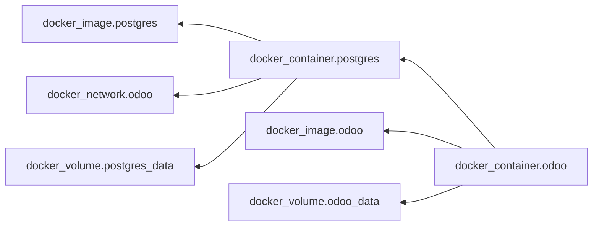

# Infra Foundations: Terraform, Docker, AWS

This is a foundation document for candidates and every new KomITi engineer learning the infrastructure layer from scratch, but through the real KomITi AWS/Terraform/Docker context, not through abstract toy examples.

The purpose is not to turn you into a cloud/platform specialist in 4 hours, but to give you an operational mental model:
- what AWS does in KomITi,
- what Docker and the terminal command `docker compose` do,
- what Terraform and its terminal commands do,
- and how these three layers connect into a single system.

## Table of Contents

1\) What is the infra stack in KomITi<br>
2\) AWS fundamentals you need to know<br>
3\) Docker and container fundamentals you need to know<br>
4\) Terraform<br>
&nbsp;&nbsp;&nbsp;&nbsp;4.1\) Terraform mental model<br>
&nbsp;&nbsp;&nbsp;&nbsp;4.2\) What is a provider<br>
&nbsp;&nbsp;&nbsp;&nbsp;4.3\) What are resource, data source, and output<br>
&nbsp;&nbsp;&nbsp;&nbsp;4.4\) Directory structure: general and KomITi-specific<br>
&nbsp;&nbsp;&nbsp;&nbsp;4.5\) Terraform files in [modules/]<br>
&nbsp;&nbsp;&nbsp;&nbsp;4.6\) Terraform files in [root stack/]<br>
&nbsp;&nbsp;&nbsp;&nbsp;4.7\) Dependency reasoning<br>
&nbsp;&nbsp;&nbsp;&nbsp;4.8\) Summarizing what Terraform code typically means in this repo<br>
&nbsp;&nbsp;&nbsp;&nbsp;4.9\) How AWS, Docker, and Terraform connect into a single flow<br>
&nbsp;&nbsp;&nbsp;&nbsp;4.10\) Terraform vs Docker Compose: same information, different place of record<br>
5\) How to turn Terraform files into action and materialize artifacts (Docker containers, AWS resources, Odoo)<br>
&nbsp;&nbsp;&nbsp;&nbsp;5.1\) Plan is not a formality<br>
&nbsp;&nbsp;&nbsp;&nbsp;5.2\) Apply is not a deploy script<br>
6\) Minimal safe workflow in KomITi<br>
7\) KomITi infra checklist<br>
8\) Foundations practical drill<br>
9\) Local Terraform + Docker Desktop lab for candidates<br>
10\) What to read next<br>
99\) Task on the komiti_academy project for candidates

## 1) What is the infra stack in KomITi

When we say "infra" in this repo, we don't mean a single tool, but multiple layers working together:
- AWS is the cloud substrate: VM, network, IP, security boundary, disk,
- Docker is the runtime packaging and local orchestration layer: how a service is packaged and run in a container, and how multiple services are coordinated via the terminal command `docker compose`,
- Terraform is the infrastructure-as-code layer that describes and modifies AWS resources,
- Odoo/Caddy/Postgres are the application/runtime workload that lives on that layer.

The professional thinking here is:
- Terraform does not replace Docker,
- Docker does not replace AWS,
- AWS does not replace application verification,
- each layer has its own purpose, its own risk, and its own operational vocabulary.

## 2) AWS fundamentals you need to know

In this learning context, you don't study AWS as a catalog of 200 services, but as a minimal operational set.

The most important concepts are:
- region: the geographic/operational context in which resources live, and in which you must consistently reason about latency, availability, and resource locality,
- `EC2`: the virtual machine where the runtime actually lives,
- `VPC` / subnet: network space and segmentation,
- security group: inbound/outbound firewall boundary,
- `EIP` (`Elastic IP`): a stable public IP address,
- `S3`: the object storage layer where backups and other artifacts that don't belong to the VM's own filesystem are often kept,
- `Route 53` / DNS thinking: how a domain reaches the right host,
- disk/volume reasoning: runtime is not just CPU and RAM but also storage.

In the KomITi mental model, this typically means:
- region determines in which AWS context the runtime and dependent resources even exist,
- a single EC2 host carries the runtime layer,
- security group determines who can reach SSH/HTTP/HTTPS,
- `S3` carries the backup/storage layer that you don't want tied solely to the lifecycle of a single VM,
- EIP and DNS bind the host to a public endpoint,
- network and security boundary are part of production safety, not a side detail.

A junior mistake is to view AWS as "just a server". A better mental model is:
- region = where your compute and other resources actually live,
- EC2 = compute,
- security group = who is allowed to talk to that compute,
- S3 = durable object storage for backups and operational artifacts,
- subnet/VPC = where that compute lives,
- IP/DNS = how other systems reach it.

## 3) Docker and container fundamentals you need to know

A container is not a virtual machine. It is an isolated runtime process with its own filesystem view, network namespace, and agreed-upon entrypoint.

The most important concepts are:
- image: the template from which a container is created,
- container: a running instance of that image,
- volume: persistent data you don't want to lose when the container is re-created,
- port mapping: how a service inside a container becomes accessible to the host,
- environment variables: runtime configuration,
- `docker compose`: a declarative description of multiple services working together.

In the KomITi context, it's important to adopt early:
- Odoo often doesn't run alone, but with Postgres, a reverse proxy, and other helper layers,
- `docker compose` is the agreement on how these services live together,
- restarting a container is not the same as rebuilding an image,
- ephemeral container filesystem is not the same as persistent data.

Practical thinking:
- image = what you run,
- container = what is currently running,
- compose = how multiple containers form a single runtime system,
- volume = what must survive a restart/recreate cycle.

## 4) Terraform

### 4.1) Terraform mental model

Terraform is an infrastructure-as-code tool.

Its essence is not "create me one EC2", but:
- describe the desired state of infrastructure as code,
- compare that state with what actually exists,
- get a plan of changes,
- apply those changes in a controlled manner.

In the KomITi context, this means:
- DEV and PROD AWS environments are described with Terraform code,
- EC2, networking, security groups, and EIP are not manual clicks in the AWS console,
- `terraform plan` is proof of what will change,
- `terraform apply` is a controlled application,
- the state file `terraform.tfstate` is Terraform's runtime truth about the resources it manages; in the odoo4komiti repo you can see it, for example, at `infra/aws/odoo-dev-ec2-compose/terraform.tfstate`.

### 4.2) What is a provider

A provider is a plugin that enables Terraform to communicate with a given system.

In this repo, the most important one is: the AWS provider. Practically:
- Terraform by itself doesn't know what EC2, VPC, or Elastic IP is,
- the AWS provider gives it that vocabulary and API bridge.

If you look at Terraform code, the `provider` layer is what connects Terraform to the actual cloud.

### 4.3) What are resource, data source, and output

`resource` describes something that Terraform creates or modifies. Examples from our AWS context:
- EC2 instance,
- security group,
- elastic IP,
- route table,
- key pair.

`data` reads something that already exists, without ownership over that resource. Practically:
- resource = Terraform manages the lifecycle,
- data source = Terraform only reads.

`output` exposes an important value outward. In the KomITi context, these are often:
- public IP,
- SSH command,
- HTTP/HTTPS URL,
- other runtime identifiers you need after `apply`.

### 4.4) Directory structure: general and KomITi-specific

When you first read a Terraform repo, it's not enough to know what a `resource` is; you also need to know where things live.

The KomITi-specific layout looks roughly like this:

```text
KOMITI КОНКРЕТНО

[infra/]
	|
	+-- [aws/]
		 |
		 +-- CODEX_TERRAFORM.md                          -> КомИТи policy/disciplina документ made by КомИТи
		 +-- [modules/]                                  -> reusable Terraform module-и
		 |    |
		 |    +-- [odoo_ec2_compose/]                    -> shared module који root stack-ови reuse-ују
		 |         |
		 |         +-- main.tf                           -> module internal resources и wiring
		 |         +-- variables.tf                      -> inputs које module прима од root stack-а
		 |         +-- outputs.tf                        -> module outputs
		 +-- [odoo-dev-ec2-compose/] је [root stack/] за dev
		 |    |
		 |    +-- main.tf / versions.tf                  -> root Terraform setup
		 |    +-- network.tf / security.tf / compute.tf / locals.tf
		 |    +-- variables.tf / outputs.tf              -> root inputs/outputs за dev stack, не за унутрашњост module-а
		 |    +-- templates/ / scripts/                  -> template-и и helper оперативне скрипте
		 |    +-- README.md / RUNBOOK.md                 -> operator documentation
		 |    +-- terraform.tfvars / terraform.tfstate   -> локални runtime/state фајлови, нису за commit
		 |    +-- .terraform/ / .terraform.lock.hcl      -> локални provider/cache и lock после init
		 |
		 +-- [odoo-prod-ec2-compose/] је [root stack/] за prod
				|
				+-- main.tf / versions.tf
				+-- network.tf / security.tf / compute.tf / locals.tf
				+-- variables.tf / outputs.tf
				+-- templates/ / scripts/
				+-- README.md / RUNBOOK.md
				+-- terraform.tfvars / terraform.tfstate
				+-- .terraform/ / .terraform.lock.hcl
```

A short rule for reading this layout: `modules/odoo_ec2_compose/main.tf` and `modules/odoo_ec2_compose/variables.tf` belong to the reusable module, while `odoo-dev-ec2-compose/main.tf` and `odoo-dev-ec2-compose/variables.tf` belong to the root stack that calls that module. In other words, they are not duplicates serving the same role: the module has its own internal Terraform API, and the root stack has its own environment-level API.

Practically, when we say "Terraform code for DEV", in this repo that most often means: open `infra/aws/odoo-dev-ec2-compose/` and read that directory as a single infrastructure system.

Keep in mind that the name `odoo-dev-ec2-compose` already carries 3 layers within it:
- `ec2` = AWS compute host,
- `compose` = Docker runtime orchestration on that host,
- Terraform `.tf` files = the infrastructure description that creates that host and its boundary.

### 4.5) Terraform files in [modules/]

Once you see that `odoo_ec2_compose/` exists in `modules/`, it's important not to think of it as just a helper folder. It is a reusable Terraform building block that root stacks call.

There are 3 key files in that module:

#### 4.5.1) `main.tf`

`main.tf` in the module describes the internal logic of the reusable block: which AWS resources the module creates and how they are connected. In our KomITi example, you can see that the module builds multiple layers at once, e.g. `VPC`, subnet, route table, security group, and other resources that the root stack doesn't want to write from scratch every time.

In the actual `modules/odoo_ec2_compose/main.tf`, short teaching comments have been added alongside `resource "aws_vpc" "main"` and `resource "aws_subnet" "public_a"`. The comments illustrate two important things: that the module first establishes the network foundation, and that the subnet already reveals a dependency on the VPC and a public/private designation.

Practically: if you want to understand what `odoo_ec2_compose` actually does when a dev/prod stack calls it, the module `main.tf` is the first place to read.

#### 4.5.2) `variables.tf`

`variables.tf` in the module defines the input API of that reusable block. Here the module says: if you want to use me, you must provide or may provide values such as `name_prefix`, `env`, `allowed_ssh_cidr`, `instance_type`, `ssh_public_key`, and so on. In other words: the root stack calls the module via its own `main.tf`, and the module's `variables.tf` determines what that call is allowed and required to pass.

#### 4.5.3) `outputs.tf`

`outputs.tf` in the module defines what the module returns back to the root stack. In our case, these are important operational values such as public IP, elastic IP, or backup bucket name. This matters because the root stack often doesn't just want to "fire up" the module, but also to take some of its results and show them to the operator or pass them further.

### 4.6) Terraform files in [root stack/]

Once you understand the directory structure, it makes sense to also read what the key Terraform files inside that stack do.

#### 4.6.1) Terraform State `terraform.tfstate`

`terraform.tfstate` is the critical artifact that contains the state of all resources.

State remembers:
- which resources Terraform considers its own,
- their IDs,
- attributes needed for the next plan,
- the dependency graph that has already been materialized at runtime.

That's why these rules are important:
- state is not committed to git,
- state may contain sensitive data,
- losing state is not a "minor problem" but an operational problem,
- manual changes in the AWS console can create drift between state and reality.

In the KomITi way of working, you must adopt early:
- source code is not sufficient,
- Terraform state + cloud runtime = the actual truth.

Do not make manual changes directly in the AWS console, because manual modifications that the Terraform code and state don't track quickly create drift between the Terraform picture and the actual runtime.

- code can say one thing, state can remember another, and the cloud runtime can look like a third;
- if you manually change a resource in an incident situation, document what was done;
- return ownership to code and state discipline as soon as possible;
- read `terraform plan` also as a drift detector, not just as an apply prelude.

#### 4.6.2) `variables.tf`, `terraform.tfvars.example`, and `terraform.tfvars`

Variables are the input parameters of a Terraform configuration.

They exist so that code doesn't hardcode:
- CIDR rules,
- instance type,
- domain,
- key naming/runtime values,
- sometimes credentials/secrets, if the model allows it.

There are 3 distinct files to understand here:

The file `variables.tf` describes which input parameters exist at all, what their types are, and what is optional or has a default value. Not every variable needs a default; the point of this file is to define the schema that the stack expects. There you can see, for example, that Terraform expects `instance_type`, `domain_name`, or `allowed_ssh_cidr`.

The file `terraform.tfvars` (`terraform.tfvars.example` is nothing other than an example of how `terraform.tfvars` should look) contains the actual, local values that Terraform uses during `plan`/`apply`. This is where the real `instance_type`, domain, SSH CIDR, and so on for that clone and that environment actually reside. In the PROD context, the designated local location is `infra/aws/odoo-prod-ec2-compose/terraform.tfvars`, if the operator actually creates it for that environment. Important: the DEV and PROD stacks intentionally don't use the same secret model here. That's why the actual `infra/aws/odoo-prod-ec2-compose/terraform.tfvars` for PROD is not version-controlled in the repo, and even when the operator creates it locally, it must not contain PROD secrets. Under this model, secret data is kept on the PROD EC2 server itself, not in Terraform git artifacts; this is defined in `infra/aws/CODEX_TERRAFORM.md`, chapter `5.2 Terraform apply`.

A Terraform beginner often sees a variable and assumes it's normal to put every password in `tfvars`.

That is not always acceptable.

You must think about:
- whether that value ends up in state,
- whether state is stored locally or remotely,
- who has access to that state,
- whether the secret belongs to the Terraform layer or the bootstrap/runtime layer.

In the KomITi context, it's especially important:
- DEV has somewhat more tolerance for lab/runtime convenience,
- PROD has stricter secret discipline,
- not every operational secret is a good Terraform secret.

Key discipline:
- `terraform.tfvars` can be sensitive,
- it does not go into git,
- for PROD especially, don't push DB/Odoo passwords into Terraform if they'll end up in state,
- the files `terraform.tfstate` and `terraform.tfstate.backup` are local state artifacts; in this repo you can see them, for example, at `infra/aws/odoo-dev-ec2-compose/terraform.tfstate` and `infra/aws/odoo-dev-ec2-compose/terraform.tfstate.backup`, and that's precisely why they should not become a normal part of version control.

#### 4.6.3) `main.tf`

`main.tf` is most often the entry point of a stack: there you typically first see which modules are used, how the root stack connects to them, and which key variables are passed to them. If you're opening just one Terraform file to get a quick picture of the architecture, `main.tf` is usually the best first place.

The difference compared to `main.tf` from `#### 4.5.1)` is in the level of responsibility:
- module `main.tf` describes what the reusable block creates internally,
- root stack `main.tf` describes how a specific dev/prod environment calls that module and with which values.

In other words: in `modules/odoo_ec2_compose/main.tf` you're looking at the internal implementation of the reusable block, while in `odoo-dev-ec2-compose/main.tf` or `odoo-prod-ec2-compose/main.tf` you're looking at the orchestration layer that incorporates that block into an actual environment.

In the KomITi context, this means: `main.tf` often doesn't give you all the details about every AWS resource, but it's the first to show you the shape of the stack and how the compute, network, security, and bootstrap layers are connected.

#### 4.6.4) `network.tf`

`network.tf` is the file where the network topology logic most often lives: `VPC`, subnets, route tables, internet gateway, and similar. If you want to understand where EC2 actually lives and how it even reaches the internet, this is one of the first files you should read.

#### 4.6.5) `outputs.tf`

`outputs.tf` is the file that declares which important values Terraform exposes to the operator after `apply`. These are often public IP, SSH command, URL, or some other identifier you need immediately for the next operational step.

That's why `outputs.tf` is important: it's the bridge between infra code and operator work. Without it, Terraform can successfully create resources while the person doing the deploy still can't quickly see what their most important next entry point into the system is.

### 4.7) Dependency reasoning

One of the most important Terraform concepts is the dependency graph.

Terraform must know:
- what depends on what,
- in what order resources are created,
- what may only be destroyed after what,
- where a reference means an implicit dependency.

Practically:
- EC2 can depend on the subnet and security group,
- route table association depends on the network,
- an output often depends on a resource that was just created.

On the local `komiti_academy` Docker Desktop lab, that dependency graph looks roughly like this:

If the candidate has Graphviz `dot` installed, the graph can be generated from the terminal like this:

```bash
terraform graph | dot -Tpng > graph.png
```

Below is also a Mermaid variant of the same dependency relationship, useful when you want to read the graph directly in a markdown document:



When you see an arrow in this example:
-  `docker_container.odoo --> docker_container.postgres` means that `docker_container.odoo` depends on `docker_container.postgres`;
- `docker_network.odoo` is a foundation node within this graph, and `docker_container.postgres` is shown in the diagram as a node that binds to that network;
- from the remaining dependencies you can then see that `docker_container.odoo` is not standalone, but depends on other runtime elements (`docker_container.postgres`, `docker_image.odoo`, `docker_volume.odoo_data`).

A junior mistake is to look file by file, rather than graph by graph.

### 4.8) Summarizing what Terraform code typically means in this repo

When reading AWS Terraform directories, think like this:

- `network.tf` = networking topology
- `security.tf` = security boundary
- `compute.tf` = instance/runtime host
- `locals.tf` = naming/tagging/helper composition
- `variables.tf` = what is configurable
- `outputs.tf` = what the operator needs after apply
- `templates/*.tpl` = rendered bootstrap/user-data content

This is the infrastructure equivalent of the Odoo mental model:
- model -> resource
- field -> argument/attribute
- action/menu wiring -> dependency/reference wiring
- runtime upgrade -> plan/apply cycle

### 4.9) How AWS, Docker, and Terraform connect into a single flow

The most useful foundations mental model for this repo is the following sequence:

1. Terraform defines AWS resources.
2. AWS provides the host, network, security boundary, and public endpoint.
3. On that host, Docker/Compose runs the application services.
4. Only then do you measure whether the Odoo runtime is actually healthy.

That's why it's important not to mix problem classes:
- if a security group isn't allowing traffic, that's not a Docker bug,
- if a container won't start a service, that's not necessarily a Terraform bug,
- if Odoo is up but a functional flow doesn't work, that's no longer a pure infra problem.

This is the essence of infrastructure reasoning: the same incident can look like "the system doesn't work", but the root cause can be in an entirely different layer.

### 4.10) Terraform vs Docker Compose: same information, different place of record

Below is a mapping of the local `komiti_academy` lab so you can clearly see where the same runtime information is recorded in the Terraform variant versus the Compose variant. In a real scenario, Terraform files and Docker Compose complement each other, since you use each for what it does best. But in this `komiti_academy` lab, you should view these two approaches as mutually exclusive variants (you use either Terraform or Docker Compose, not both simultaneously for the same runtime).

<table>
	<colgroup>
		<col width="18%">
		<col width="47%">
		<col width="35%">
	</colgroup>
	<thead>
		<tr>
			<th>Information</th>
			<th>Terraform</th>
			<th>Compose</th>
		</tr>
	</thead>
	<tbody>
		<tr>
			<td>Local academy runtime name</td>
			<td><a href="infra/local/odoo-dev-docker-desktop/locals.tf">locals.tf</a> - <code>name_prefix</code></td>
			<td><a href="infra/local/odoo-dev-docker-desktop/docker-compose.yml">docker-compose.yml</a> - <code>name: komiti-academy-dev</code></td>
		</tr>
		<tr>
			<td>Odoo image</td>
			<td><div><strong>default:</strong> <a href="infra/local/odoo-dev-docker-desktop/variables.tf">variables.tf</a> - <code>odoo_image</code> = <code>odoo:19.0</code></div><div><strong>actual value:</strong> <a href="infra/local/odoo-dev-docker-desktop/terraform.tfvars">terraform.tfvars</a> - <code>odoo:19.0</code></div><div><strong>where applied:</strong> <a href="infra/local/odoo-dev-docker-desktop/compute.tf">compute.tf</a> - <code>docker_image.odoo</code></div></td>
			<td><a href="infra/local/odoo-dev-docker-desktop/docker-compose.yml">docker-compose.yml</a> - <code>services.odoo.image</code></td>
		</tr>
		<tr>
			<td>Postgres image</td>
			<td><div><strong>default:</strong> <a href="infra/local/odoo-dev-docker-desktop/variables.tf">variables.tf</a> - <code>postgres_image</code> = <code>postgres:16</code></div><div><strong>actual value:</strong> <a href="infra/local/odoo-dev-docker-desktop/terraform.tfvars">terraform.tfvars</a> - <code>postgres:16</code></div><div><strong>where applied:</strong> <a href="infra/local/odoo-dev-docker-desktop/compute.tf">compute.tf</a> - <code>docker_image.postgres</code></div></td>
			<td><a href="infra/local/odoo-dev-docker-desktop/docker-compose.yml">docker-compose.yml</a> - <code>services.postgres.image</code></td>
		</tr>
		<tr>
			<td>Host port for Odoo</td>
			<td><div><strong>default:</strong> <a href="infra/local/odoo-dev-docker-desktop/variables.tf">variables.tf</a> - <code>odoo_port</code> = <code>8067</code></div><div><strong>actual value:</strong> <a href="infra/local/odoo-dev-docker-desktop/terraform.tfvars">terraform.tfvars</a> - <code>odoo_port = 8067</code></div><div><strong>where applied:</strong> <a href="infra/local/odoo-dev-docker-desktop/compute.tf">compute.tf</a> - <code>ports.external</code> = <code>var.odoo_port</code></div></td>
			<td><a href="infra/local/odoo-dev-docker-desktop/docker-compose.yml">docker-compose.yml</a> - <code>services.odoo.ports</code></td>
		</tr>
		<tr>
			<td>Mapping <code>8067 -&gt; 8069</code></td>
			<td><a href="infra/local/odoo-dev-docker-desktop/compute.tf">compute.tf</a> - <code>ports { external = var.odoo_port, internal = 8069 }</code></td>
			<td><a href="infra/local/odoo-dev-docker-desktop/docker-compose.yml">docker-compose.yml</a> - <code>"${ODOO_PORT:-8067}:8069"</code></td>
		</tr>
		<tr>
			<td>Postgres DB name</td>
			<td><div><strong>default:</strong> <a href="infra/local/odoo-dev-docker-desktop/variables.tf">variables.tf</a> - <code>postgres_db</code> = <code>komiti_academy_odoo</code></div><div><strong>actual value:</strong> <a href="infra/local/odoo-dev-docker-desktop/terraform.tfvars">terraform.tfvars</a> - <code>komiti_academy_odoo</code></div><div><strong>where applied:</strong> <a href="infra/local/odoo-dev-docker-desktop/compute.tf">compute.tf</a> - <code>POSTGRES_DB</code> = <code>${var.postgres_db}</code></div></td>
			<td><a href="infra/local/odoo-dev-docker-desktop/docker-compose.yml">docker-compose.yml</a> - <code>POSTGRES_DB</code></td>
		</tr>
		<tr>
			<td>Postgres user</td>
			<td><div><strong>default:</strong> <a href="infra/local/odoo-dev-docker-desktop/variables.tf">variables.tf</a> - <code>postgres_user</code> = <code>odoo</code></div><div><strong>actual value:</strong> <a href="infra/local/odoo-dev-docker-desktop/terraform.tfvars">terraform.tfvars</a> - <code>admin.komiti_odoo</code></div><div><strong>where applied:</strong> <a href="infra/local/odoo-dev-docker-desktop/compute.tf">compute.tf</a> - <code>POSTGRES_USER</code> and Odoo <code>USER</code></div></td>
			<td><a href="infra/local/odoo-dev-docker-desktop/docker-compose.yml">docker-compose.yml</a> - <code>POSTGRES_USER</code> and Odoo <code>USER</code></td>
		</tr>
		<tr>
			<td>Postgres password</td>
			<td><div><strong>default:</strong> <a href="infra/local/odoo-dev-docker-desktop/variables.tf">variables.tf</a> - <code>postgres_password</code> = no default value</div><div><strong>actual value:</strong> <a href="infra/local/odoo-dev-docker-desktop/terraform.tfvars">terraform.tfvars</a> - <code>komiti-academy-local-dev</code></div><div><strong>where applied:</strong> <a href="infra/local/odoo-dev-docker-desktop/compute.tf">compute.tf</a> - <code>POSTGRES_PASSWORD</code> and Odoo <code>PASSWORD</code></div></td>
			<td><a href="infra/local/odoo-dev-docker-desktop/docker-compose.yml">docker-compose.yml</a> - <code>POSTGRES_PASSWORD</code> and Odoo <code>PASSWORD</code></td>
		</tr>
		<tr>
			<td>Odoo connects to Postgres on host <code>db</code></td>
			<td><a href="infra/local/odoo-dev-docker-desktop/compute.tf">compute.tf</a> - Odoo env <code>HOST=db</code> and Postgres network alias <code>db</code></td>
			<td><a href="infra/local/odoo-dev-docker-desktop/docker-compose.yml">docker-compose.yml</a> - Odoo <code>HOST: db</code> and network alias <code>db</code></td>
		</tr>
		<tr>
			<td>Addons bind mount</td>
			<td><a href="infra/local/odoo-dev-docker-desktop/locals.tf">locals.tf</a> - <code>addons_host_path</code><br><a href="infra/local/odoo-dev-docker-desktop/compute.tf">compute.tf</a> - used in volume mount to <code>/mnt/extra-addons</code></td>
			<td><a href="infra/local/odoo-dev-docker-desktop/docker-compose.yml">docker-compose.yml</a> - <code>../../../custom-addons:/mnt/extra-addons:rw</code></td>
		</tr>
		<tr>
			<td>Odoo data volume</td>
			<td><a href="infra/local/odoo-dev-docker-desktop/compute.tf">compute.tf</a> - <code>docker_volume.odoo_data</code></td>
			<td><a href="infra/local/odoo-dev-docker-desktop/docker-compose.yml">docker-compose.yml</a> - <code>odoo-data:/var/lib/odoo</code></td>
		</tr>
		<tr>
			<td>Postgres data volume</td>
			<td><a href="infra/local/odoo-dev-docker-desktop/compute.tf">compute.tf</a> - <code>docker_volume.postgres_data</code></td>
			<td><a href="infra/local/odoo-dev-docker-desktop/docker-compose.yml">docker-compose.yml</a> - <code>postgres-data:/var/lib/postgresql/data</code></td>
		</tr>
		<tr>
			<td>Network</td>
			<td><a href="infra/local/odoo-dev-docker-desktop/network.tf">network.tf</a> - <code>docker_network.odoo</code></td>
			<td><a href="infra/local/odoo-dev-docker-desktop/docker-compose.yml">docker-compose.yml</a> - <code>networks.academy</code></td>
		</tr>
		<tr>
			<td>Odoo dependency on Postgres</td>
			<td><a href="infra/local/odoo-dev-docker-desktop/compute.tf">compute.tf</a> - <code>depends_on = [docker_container.postgres]</code></td>
			<td><a href="infra/local/odoo-dev-docker-desktop/docker-compose.yml">docker-compose.yml</a> - <code>depends_on.postgres.condition: service_healthy</code></td>
		</tr>
		<tr>
			<td>URL output</td>
			<td><a href="infra/local/odoo-dev-docker-desktop/outputs.tf">outputs.tf</a> - <code>odoo_url</code></td>
			<td>No output block; the practical equivalent is <code>ports</code> and the command <code>docker compose ps</code></td>
		</tr>
	</tbody>
</table>

Especially important notes:

<table>
	<colgroup>
		<col width="20%">
		<col width="18%">
		<col width="18%">
		<col width="44%">
	</colgroup>
	<thead>
		<tr>
			<th>Topic</th>
			<th>Terraform</th>
			<th>Compose</th>
			<th>What this means</th>
		</tr>
	</thead>
	<tbody>
		<tr>
			<td>Master Password for localhost Odoo</td>
			<td>Not explicitly defined</td>
			<td>Not explicitly defined</td>
			<td>None of your academy files currently set <code>admin_passwd</code>, so the password you see in the browser does not come directly from this Terraform/Compose wiring.</td>
		</tr>
		<tr>
			<td>Postgres healthcheck</td>
			<td>None</td>
			<td>Present</td>
			<td>The Compose variant is a bit richer here, because it has an explicit <code>healthcheck</code> and waits for Postgres to be healthy before starting Odoo.</td>
		</tr>
		<tr>
			<td>Docker Desktop UI grouping</td>
			<td>No Compose metadata</td>
			<td>Has Compose metadata</td>
			<td>That's why Compose is grouped in the Docker Desktop UI, while Terraform Docker provider resources look more like individual Docker objects.</td>
		</tr>
		<tr>
			<td>State</td>
			<td><code>terraform.tfstate</code></td>
			<td>No single state file</td>
			<td>Terraform remembers the desired and actual state in its state, while Compose relies more on the current Docker engine state and Compose project metadata labels.</td>
		</tr>
	</tbody>
</table>

## 5) How to turn Terraform files into action and materialize artifacts (Docker containers, AWS resources, Odoo)

### 5.1) Plan is not a formality

`terraform plan` is a terminal command, and it is not a checkbox before `apply`.

Its purpose is to clearly show you:
- what will be created,
- what will be modified,
- what will be deleted,
- whether a seemingly small change has a large blast radius.

Professional thinking means:
- first you read the plan,
- then you assess the impact,
- only then do you run `apply`.

If you can't read a Terraform plan, then you are not yet operationally safe for infrastructure work.

### 5.2) Apply is not a deploy script

The terminal command `terraform apply` does not mean "I launched the server and I'm done".

Apply means:
- Terraform has applied an infrastructure change,
- state has been updated,
- the cloud resource layer has been brought closer to the described state.

But that is not the same as:
- the application being functional,
- the compose stack being healthy,
- Odoo being operational,
- day-2 ops steps being completed.

In the KomITi AWS context, the flow often goes like this:
1. Terraform brings up the infrastructure skeleton.
2. The bootstrap/compose/runtime layer brings the application to an operational state.
3. Then verification follows.

This is the same mental discipline as with Odoo: infra code truth is not the same as runtime truth.

## 6) Minimal safe workflow in KomITi

When making a Terraform change, the minimum safe sequence is:

1. understand what you're changing at the resource level,
2. verify variables and environment context,
3. run `terraform init` if needed,
4. run `terraform validate`,
5. run `terraform plan`,
6. read the impact,
7. only then run `terraform apply`,
8. verify outputs and runtime,
9. document the operational delta if significant.

This is not bureaucracy; it is basic production discipline.

## 7) KomITi infra checklist

When you finish this document, you must be able to explain:
- what AWS provides and what it doesn't,
- what is an image and what is a container,
- what `docker compose` does,
- what a provider is,
- what is a resource and what is a data source,
- why state is critical,
- why you read `plan` before `apply`,
- why `terraform.tfvars` and state don't go into git,
- why infrastructure apply is not the same as application verification,
- how to read an AWS Terraform folder as a system, not as a collection of random `.tf` files,
- how to distinguish an AWS problem, a Docker/runtime problem, and an Odoo functional problem.

## 8) Foundations practical drill

After this document, do at least the following:

1. Open `infra/aws/odoo-dev-ec2-compose`.
2. Find `variables.tf`, `compute.tf`, `security.tf`, `outputs.tf`.
3. Explain which `.tf` file defines the host, which defines the network boundary, and which defines the operator outputs.
4. Explain where in that stack Terraform ends and Docker/runtime reasoning begins.
5. Explain why `terraform plan` must come before `apply`.
6. Explain why for PROD we don't want DB/Odoo passwords to live in Terraform state.
7. Explain the difference between `infra/aws/CODEX_TERRAFORM.md` and a root stack directory such as `infra/aws/odoo-dev-ec2-compose/`.

If you can't explain these without guessing, you haven't truly internalized the infra foundations yet.

This infra drill is not directly a module implementation task, but it's preparation so that later for `komiti_academy` you can distinguish a code problem, a runtime problem, and an infra problem.

## 9) Local Terraform + Docker Desktop lab for candidates

If the candidate doesn't have an AWS/Azure lab budget, it makes sense to do the first Terraform lab locally via Docker Desktop.
This lab is not part of the core product scope of the `komiti_academy` module, but a learning/support exercise so the candidate can locally bring up the runtime on which they'll later develop and verify the Odoo module.

The purpose of this lab is not to simulate a real cloud deployment, but for the candidate to practically exercise:
- the structure of a Terraform project,
- `variables.tf`, `outputs.tf`, `terraform.tfvars.example`, and a local `terraform.tfvars`,
- separation between `dev` and `prod` variants of a stack,
- naming conventions,
- the `plan` / `apply` / `destroy` cycle,
- the idea that Terraform brings the runtime skeleton to a state where Odoo can start.

This lab does not teach real cloud networking, VM lifecycle, or cloud security boundary. You must know this so you don't confuse a local Docker lab with actual AWS/Azure infra work.
You should view this lab as a bridge: patterns around variables, outputs, naming, and environment separation can later be transferred to AWS/Azure Terraform work, but this is not a 1:1 cloud template.

The suggested lab should live in your repo `komiti_academy_ime_polaznika`, for example like this:
- `infra/local/odoo-dev-docker-desktop/`
- `infra/local/odoo-prod-docker-desktop/`

Within each of those two root directories, the candidate should have at least:
- `versions.tf`
- `main.tf`
- `variables.tf`
- `outputs.tf`
- `terraform.tfvars.example`
- a local `terraform.tfvars` that doesn't go into git

The minimal runtime that Terraform should bring up locally is:
- one Docker network,
- one Postgres container,
- one Odoo container,
- a volume for Postgres data,
- volume or mount reasoning for Odoo config/addons if the lab reaches that phase,
- an operator output that says on which URL Odoo should be accessible.

A good minimum viable lab is:
1. Terraform Docker provider locally manages the Docker Desktop runtime.
2. `main.tf` creates the network, volume, and both containers.
3. `variables.tf` carries the environment name, port, DB credentials for the lab, and naming prefix.
4. `outputs.tf` outputs a URL like `http://localhost:8069` and key resource names.
5. `terraform.tfvars.example` exists for both `dev` and `prod`, so the candidate sees the separation even when both stacks live locally.

The bootstrap idea in this local lab doesn't mean cloud-init on a VM, but:
- Terraform first brings the Docker resources to the desired state,
- then the Odoo container receives the environment/config to communicate with Postgres,
- only then do you verify whether the runtime is actually up.

The minimum safe lab flow should be:
1. `terraform init`
2. `terraform validate`
3. `terraform plan -var-file=terraform.tfvars`
4. `terraform apply -var-file=terraform.tfvars`
5. `docker ps` and verify that Odoo and Postgres are up
6. open the Odoo URL from the `output` value
7. `terraform destroy -var-file=terraform.tfvars`

If the candidate successfully completes this lab, then they've truly practiced the Terraform shape and lifecycle discipline, even if they haven't yet done real cloud provisioning.

## 10) What to read next

- `../infra/aws/CODEX_TERRAFORM.md`
- `../infra/aws/odoo-dev-ec2-compose/README.md`
- `../infra/aws/odoo-dev-ec2-compose/RUNBOOK.md`
- `../infra/aws/odoo-prod-ec2-compose/README.md`
- `../infra/aws/odoo-prod-ec2-compose/RUNBOOK.md`

## 99) Task on the komiti_academy project for candidates

1. Write a short infra/runtime diagnostic note for `komiti_academy`: what would you check first if the module doesn't work, and what if the runtime itself isn't healthy.  
Reference: This is explained in chapters `### 4.9) How AWS, Docker, and Terraform connect into a single flow` and `## 8) Foundations practical drill`.
2. For `komiti_academy`, list which runtime assumptions must be true before actually verifying that the module works.  
Reference: This is explained in chapters `## 3) Docker and container fundamentals you need to know`, `#### 4.6.1) terraform.tfstate`, and `## 6) Minimal safe workflow in KomITi`.
3. Explain with one example why a container restart, a module upgrade, and actually verifying the affected flow are not the same thing.  
Reference: This is explained in chapters `## 3) Docker and container fundamentals you need to know`, `### 4.9) How AWS, Docker, and Terraform connect into a single flow`, and `## 6) Minimal safe workflow in KomITi`.
4. Design and locally describe a Terraform lab in your repo `komiti_academy_ime_polaznika` that uses Docker Desktop to bring up a Postgres and Odoo stack for a local `dev` runtime, with a clear file structure, variables, outputs, and a clear workflow sequence.  
Reference: This is explained in chapters `#### 4.6.2) \`variables.tf\`, \`terraform.tfvars.example\`, and \`terraform.tfvars\``, `### 4.4) Directory structure: general and KomITi-specific`, `### 5.1) Plan is not a formality`, `## 6) Minimal safe workflow in KomITi`, and `## 9) Local Terraform + Docker Desktop lab for candidates`.

Solutions:

1. For the diagnostic note, do the following in order:
	1. From `### 4.9) How AWS, Docker, and Terraform connect into a single flow`, take the pattern for how you separate the infra layer from the application layer.
	2. Separate two situations: `module doesn't work` and `runtime isn't healthy`.
	3. For each situation, write down the first 2 to 3 checks you would perform, e.g. for `runtime isn't healthy`: `containers aren't up`, `health endpoint doesn't return 200`, `service restart didn't help`.
	4. If you need a question template, take it from `## 8) Foundations practical drill` and translate it to the `komiti_academy` context.
2. For runtime assumptions, do the following in order:
	1. From `## 3) Docker and container fundamentals you need to know`, extract what must be up and accessible.
	2. From `#### 4.6.1) terraform.tfstate`, note which state must be consistent before testing.
	3. From `## 6) Minimal safe workflow in KomITi`, copy the minimal sequence of checks before actually verifying that the module works.
	4. Compile the final list of runtime assumptions into a short checklist form, e.g. `runtime up`, `health 200`, `correct database`, `fresh module upgrade`.
3. For the difference between restart, upgrade, and verifying the affected flow, do the following in order:
	1. From `## 3) Docker and container fundamentals you need to know`, extract what a runtime restart means.
	2. From `## 6) Minimal safe workflow in KomITi`, extract what a module upgrade means.
	3. Then write down what actually verifying the affected flow is and how it differs from the previous two steps.
	4. Formulate one short example on the `komiti_academy` module, e.g. `restart just brought the service up`, `upgrade loaded XML and Python changes`, `verification proved that the user can actually complete the flow without errors`.
4. For the local Terraform + Docker Desktop lab, do the following in order:
	1. In the root of your local clone of the repo `komiti_academy_ime_polaznika`, design `infra/local/odoo-dev-docker-desktop/` as the root stack directory.
	2. Within it, plan at least the files `versions.tf`, `main.tf`, `variables.tf`, `outputs.tf`, and `terraform.tfvars.example`; the result should be a clear Terraform shape even before writing all the details.
	3. In `variables.tf`, plan at least `environment`, `project_name`, `odoo_port`, `postgres_db`, `postgres_user`, and `postgres_password`, and in `outputs.tf` at least the Odoo URL and names of key Docker resources.
	4. In `main.tf`, plan for Terraform to bring up one Docker network, a Postgres volume, a Postgres container, and an Odoo container; the result should be a runtime sufficient for Odoo to communicate with the database locally.
	5. When the skeleton is ready, run the following in the terminal in order: `terraform init`, `terraform validate`, `terraform plan -var-file=terraform.tfvars`, and `terraform apply -var-file=terraform.tfvars`; the result should be Docker resources and an output with a URL like `http://localhost:8069`.
	6. Confirm the runtime with `docker ps`; the result should show at least Odoo and Postgres containers in `Up` state.
	7. Finally, write down what this lab teaches and what it doesn't: it teaches Terraform structure/lifecycle and Docker runtime wiring for the local `komiti_academy` dev runtime, but it doesn't teach real cloud VM/network/security boundary and doesn't change the core product scope of the Odoo module itself.
